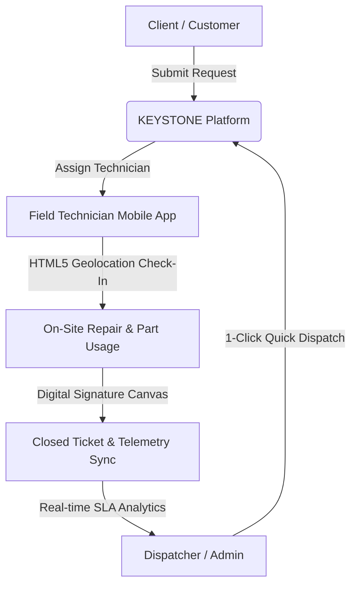

# 🗝️ KEYSTONE Field OS v2.0 Enterprise

> **Next-Generation Enterprise Field Service Automation, Live GPS Dispatch, SLA Compliance Engine & Inventory Intelligence Platform.**

[](https://keystone-field.vercel.app)
[](https://keystone-field.vercel.app)
[](https://neondb.io)
[](LICENSE)

---

## 🌟 Overview & Key Features

**KEYSTONE Field OS** is a full-stack, enterprise-grade Field Service Management (FSM) platform engineered for high-volume dispatch operations, field technician mobile workflows, SLA compliance tracking, client relationship management, and spare parts inventory auditing.



### 🎯 Core Platform Capabilities:
- **🌐 HTML5 History API URL Routing**: Real-time browser address bar path updating (`/dashboard`, `/reports`, `/customers`, `/sites`, `/inventory`, `/users`, `/field`, `/portal`) with full direct-link bookmarking and back/forward navigation support.
- **⚡ Operations Command & Quick Dispatch Matrix**: Real-time SLA tracking, automated breach alerts, and 1-click batch technician dispatching based on live workload metrics.
- **🏢 B2B Client & Site Management**: Full organizational hierarchy linking Customer Companies, Primary Representatives, Facility Sites, and On-site Contact Persons.
- **🔧 Mobile Technician Field Workspace**: On-site HTML5 GPS check-in (coordinates + open reverse geocoding), spare parts consumption logging, labour time tracking, and digital customer sign-off canvas.
- **🛡️ Multi-Role Security (RBAC)**: Role-Based Access Control enforcing distinct views for **Administrators**, **Dispatchers**, **Technicians**, and **Customers**.
- **📊 Real-Time Analytics & SLA Reports**: 100% database-grounded Technician Performance Leaderboard, SLA priority compliance rates, inventory valuation audits, and 1-click CSV report exporting.
- **🔍 Global Command Palette (`Ctrl+K` / `Cmd+K`)**: Multi-category instant search across Work Orders, Customers, Sites, Parts, and Technicians.

---

## 🌐 Live Production Deployment

Access the live production instance deployed on Vercel Edge Serverless Infrastructure with Neon PostgreSQL DB:

👉 **[https://keystone-field.vercel.app](https://keystone-field.vercel.app)**

---

## 🔐 Quick Demo Login Credentials

Test all RBAC roles instantly using these pre-configured demo credentials:

| Role | Email | Password | Primary Capabilities & Scope |
| :--- | :--- | :--- | :--- |
| **Administrator** | `admin@meridian.com` | `password123` | Full System Control, User Directory, Telemetry, Reports Export |
| **Dispatcher** | `dispatcher@meridian.com` | `password123` | Operations Command, Quick Dispatch Matrix, Kanban Board |
| **Technician** | `tech.john@meridian.com` | `password123` | Mobile Field Workspace, GPS Check-In, Parts/Time Logging, Digital Signature |
| **Customer** | `customer.acme@meridian.com` | `password123` | Customer Portal, Service Ticket Submission, 4-Step Progress Stepper |

---

## 🚀 Tech Stack & Architecture

### Backend API:
- **Java 21 / Spring Boot 3.4** (Local Enterprise Microservice)
- **Node.js Serverless API Engine** (Vercel Edge Deployment)
- **Neon Cloud PostgreSQL** (Serverless SSL Connection Pooler with Auto-Schema Migrations)
- **JWT & Bcrypt** (Secure Role-Based Session Authentication)

### Frontend SPA:
- **React 18 + TypeScript + Vite**
- **Vanilla CSS + Tailwind CSS Framework** (Custom Keystone Luminous Light Glassmorphism UI)
- **HTML5 History API** (Seamless Client-Side Routing)
- **Lucide React Icons**

---

## 🛠️ Local Installation & Setup

### Prerequisites:
- **Node.js v18+** and `npm`
- **Java 21 JDK** (Optional for local Spring Boot backend)

### 1. Clone Repository & Install Dependencies:
```bash
git clone https://github.com/SanojYadav17/Field-Service-Management-Platform.git
cd Field-Service-Management-Platform/frontend
npm install
```

### 2. Configure Environment Variables:
Create `.env` inside `frontend/`:
```env
VITE_API_BASE=http://localhost:8080/api
```

### 3. Launch Development Server:
```bash
# In frontend directory:
npm run dev

# Open http://localhost:5173 in your browser
```

---

## 📡 API Endpoint Reference

| Method | Endpoint | Description |
| :--- | :--- | :--- |
| `POST` | `/api/auth/login` | User login & JWT issuance |
| `POST` | `/api/auth/register` | User registration |
| `GET` | `/api/work-orders` | List all work orders (with SLA breach status) |
| `POST` | `/api/work-orders` | Create work order (auto-assigns status based on technician) |
| `PATCH` | `/api/work-orders/:id/assign/:techId` | Dispatch work order to technician |
| `GET` | `/api/customers` | List customer organizations & primary representatives |
| `POST` | `/api/customers` | Register customer organization |
| `GET` | `/api/reports/analytics` | Fetch real-time leaderboard & SLA metrics |
| `GET` | `/api/reports/export/csv` | Download work orders CSV report |

---

## 📄 License

Distributed under the **MIT License**. See `LICENSE` for more information. Built for enterprise field service intelligence and operational excellence.
